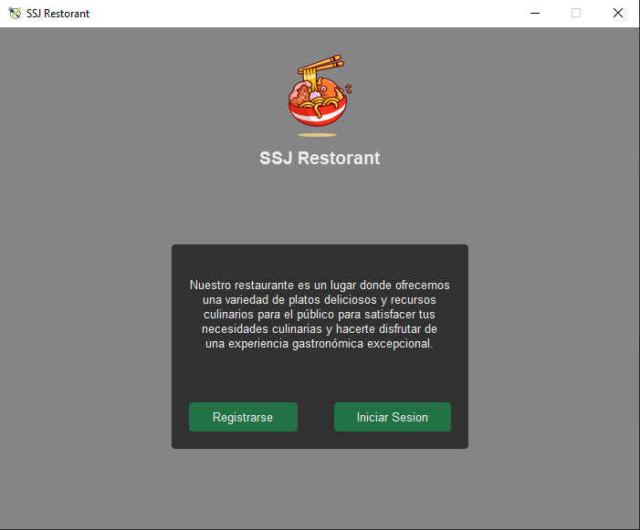
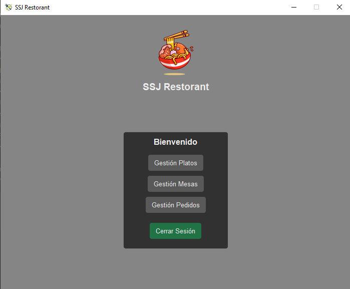
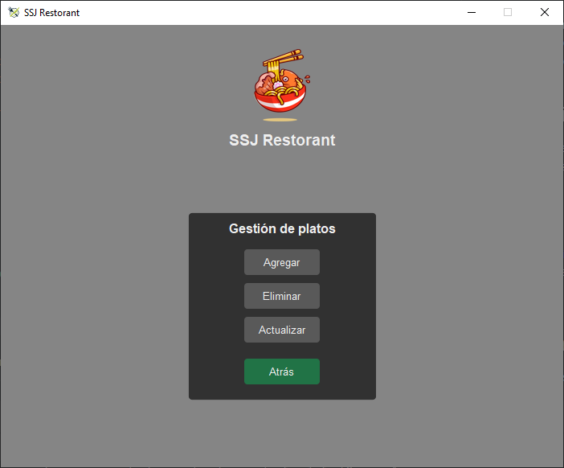

  

# SJ Restaurant

La aplicación saiyajin resaurant te ayudará a mejorar la gestión de tu restaurante
donde podrás llevar un control de los platos que ofreces, reservas de mesas y de los pedidos.

## Instalación

Solo debes de ejecutar la aplicacíon teniendo en cuenta que debes de tener instalada la versión 3.12 de python
y la versión 10.1.0 de la librería Pillow.

## Uso

Para usar la aplicación debes de tener un usuario, para ello dirigete a la opción "Registrarse" de 
la pantalla principal, si ya cuentas con uno, solo basta con iniciar sesión.

  

Una vez iniciada la sesión tendrás a disposición los menús para las gestiones anteriormente descritas

  

Aquí como ejemplo se muestra el menú para la gestión de platos, y la estructura es la misma para los otros sistemas
de gestión.

  

Si tienes alguna duda o recomendación no dudes en contactarnos, gracias!

## Licencia

Este proyecto es de licencia libre.

<h3>Authors</h3>

    <a href ="https://github.com/JD-Cifuentes" >
Juan David Cifuentes
</a>
    <a href ="https://github.com/SantiagoLopezUV">
Santiago Lopez
</a>

